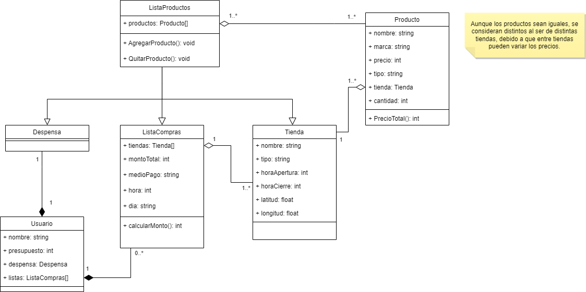

# DespensaAndGo
(Ver README en Github para mejor formato)
Link: https://github.com/franopx/DespensaAndGo

## Requerimientos
### Funcionales:
- La aplicación debe disponer de pantallas: bienvenida, home, inventario, tiendas, lista de compras y productos.
- La aplicación debe permitir la gestión del inventario y lista de compras.
- La aplicación debe permitir el registro del presupuesto, nuevos productos y tiendas.

### No Funcionales:
- La aplicación debe ser de fácil uso.
- La aplicación debe ser accesible para todo tipo de usuarios.
- La aplicación debe tener una interfaz ordenada y correctamente jerarquizada

## Diagrama de Clases

